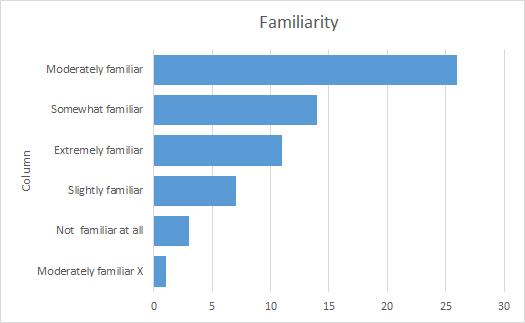
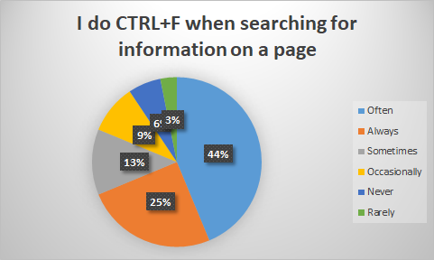
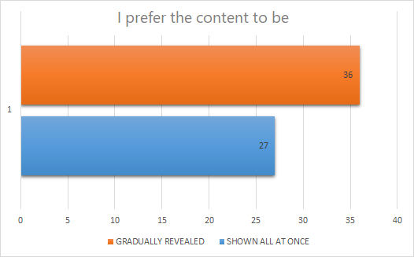
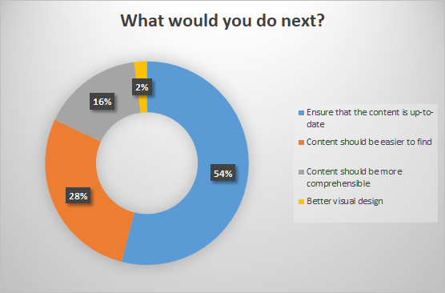

# Improving an Existing Documentation Project (3 of 3)    

> **What this article covers**  
> _Analysis of the results of the survey and the derived improvement actions_.   
> **Tools**  
> _MS Forms and Excel_.  
 
## Actioning Your Users' Feedback     

**Now that we know the current status of our documentation better** (_See [part 1]([https://www.mercedes-benz.io/2023/01/18/improving-your-development-documentation-project/)](https://javierhf.github.io/technical-write-me/improving-documentation-projects/part-1/)_) and we have gathered feedback from our users (_See [part 2](https://javierhf.github.io/technical-write-me/improving-documentation-projects/part-3/)_), it is time to analyze the results of our survey. Based on that we should then find out which improvement actions we can extract from it.  

For this article I'm providing some screenshots of the results of a real developer documentation survey.  

_Let´s the fun began!_

## Analyzing the Results  

**To analyze the results of the our survey** we will group the questions under the following categories:  

* Awareness - Is people aware of your documentation?.
* Frequency of use.   
* Search and page access behavior - How our users search and access our documentation pages.
* Page design - Does our page design meet the needs of our users?
* Next steps (According to our users).
* General perception.
* Other comments.

**Grouping our questions helps us to identify the type of issues** impacting our documentation and the domain of the solution to implement.  

## Results Categories   

**The following table shows the screenshots of the survey results,** for each category, and some quick thoughts about them:

| Category |Results | Quick Thoughts |  
| ------------- | ---------- | ---------------- |  
| **Awareness** |  | Our documentation is known but there is still space to reach more readers/users.  |  
| **Frequency of use** |  | Our documentation is being used. Yay! |
| **Search and page access behavior** | | If a great number of users do _CTRL+F_ to find content on a page, we should review our page design to ensure we are supporting that behaviour. |  
|**Page design** |  | Even if the majority of our users prefer the content being gradually reveal, a great deal of our users prefer the content being shown all at once. Let's find a balance!|  
|**Next steps**  (_According to our users_) |  | Keeping our documentation up-to-date requires finding a cross-team collaboration strategy to involve all the required Subject Matter Experts (SME). |   
| **General perception** |  | Our documentation is perceive as useful. What about opening the door more more content? |  

## What to Do Next?    

**To decide what to do next** keep in mind _the current state_ and _the needs (priorities)_ of our users. From this perspective, you can identify which improvement actions will have the highest impact on your users more accurately. 

Once you have done that, plan accordingly.

**When evaluating the current state of our documentation**, you may target some _hot potatoes_. In this case, do some firefighting first and reduce the biggest pain.  

**If we don't have any firefighting to do**, talk to your manager roles (Product Owner, Scrum Master, Lead Link, etc) or your customer/user insights roles/team to:  

* Share the survey results.  
* Explain and discuss your ideas.  
* Know their thoughts and perspective.  

**Involving management and customer/user insights roles** increases the awareness of your documentation project, and reinforces the following idea:  

> Improving product documentation impacts the adoption and ease of use and success of our product.

## Planning the Improvement Actions    

**There is no magic formula** to design an improvement plan. The following table provides, for each user survey topic group, some remarks to think about and a basic reference plan of action:

|Topic                                 | Remarks    | Reference Plan                |  
| ------------------------------------ | ----------------- | ---------------------- |   
| **Awareness and Frequency of Use** | Increase the awareness on your documentation project and collaterally the frequency of use, requires involving management roles of different levels, either to enforce the awareness or to act as radiators of information.|  <ol><li>Identify your main communication channels.</li><li>Identify your contact person (Product Owners, Product Managers, Lead Links, CEO, CTO, Scrum Masters)</li><li>Inform them about the need to increase the documentation awareness</li><li>Design the layout for your different communication topics, for example: _updates_, _warnings_, _issues_. Be simple and direct.</li><li>Schedule those communication that can be schedule</li><li>Start communicating. Be consistent</li></ol>  |  
| **Search Behaviour and Page Design** | Once we know our users' behaviour when reading our documentation, we can support that behaviour and implement some changes to help them take the most of their time using our documentation.  Both _search behaviour_ and _page design_ benefits from having a _text formatting_, _page layout_ and _visual elements_ guidelines. Having templates for each type of page also helps. |<ol><li>Design you style guidelines: _text formatting_, _header/section_ strategy and naming, use of visual elements.</li><li>Identify which type of pages are you using: _Overview_, _Getting Started_, _API Reference Guide_, _Tutorials_, _FAQ_.</li><li>A Google search or your preferred conversational LLM (Large Language Models) can help you here!</li><li>Apply your templates to all your documentation pages. Start with the most used pages. _Iterate!_</li><li>Be consistent.</li></ol>                  |                        
| **Keeping Our Documentation Up-to-Date** | Keeping our documentation up to date is a tough and cross-teams task. Again, involving the management roles of your company is of great help.|  <ol><li>Identify the Subject Matter Expert (SME) for each of the topics of your documentation.</li><li>Agree with them to schedule and set up regular documentation reviews</li><li>Implement a reminder for you to follow up this task.</li><li>Create a checklist for the SME to perform their reviews.</li><li>Keep simple and effective. Check _prerequisites_, _processes_ or _tasks_, _tools versions_ and _code examples_.</li></ol>               |                          
| **General Perception** | General perception depends on many topics. Some we can handle (transparency, support, content quality, etc), some we just can't (users not happy with their jobs, users prefer to use a different tool but are not allows, or just bad working habits).  Remember to focus in those issues you can fixed.| <ul><li>Keep a fluent and frequent communication with your users</li><li>Make them feel part of an active and helpful community</li></ul>. |  

## The End?  

Documentation projects are, in most cases, living organisms. They are born, they grow, they interact with their environment, and adapt to new _surrondings_ and _demands_. To keep our documentation alive and quicking (an our users satisfied!) communication is key.   

_Then iterate!_

